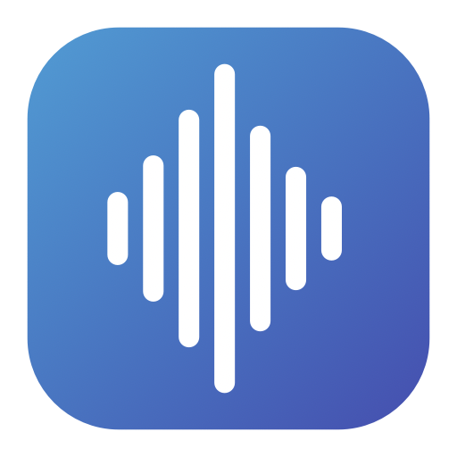
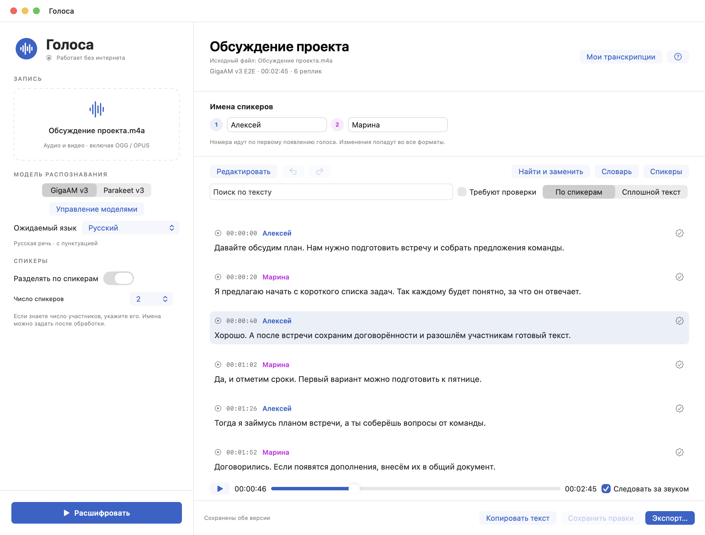

  

<h1 align="center">Голоса</h1>

  <strong>Превратите запись в текст с именами участников.</strong> 
  Встречи, интервью и лекции — на вашем Mac, без отправки аудио в облако.

  
  
  

  <a href="https://github.com/dmitryturin-art/local-transcriber/releases/download/v1.4.0/Golosa-1.4.0-AppleSilicon.dmg"><strong>↓ Скачать для macOS</strong></a>
  &nbsp; · &nbsp;
  <a href="https://github.com/dmitryturin-art/local-transcriber/releases/tag/v1.4.0">Что нового</a>
  &nbsp; · &nbsp;
  <a href="https://dmitryturin-art.github.io/local-transcriber/">Сайт приложения</a>
  &nbsp; · &nbsp;
  <a href="docs/USER_GUIDE.md">Инструкция</a>

<em>Интерфейс приложения на вымышленном диалоге. Личные записи в пример не включены.</em>

## От записи до готового текста

| На вашем компьютере | Понятный диалог | Готовый результат |
| --- | --- | --- |
| Распознавание работает локально. Интернет нужен только для скачивания моделей. | Реплики разделяются по спикерам. Имена, текст и назначения можно исправить вручную. | Пунктуация и временные метки. Копирование текста и экспорт в TXT, Markdown или SRT. |

- **Две модели на выбор:** GigaAM v3 для русского языка и Parakeet v3 для многоязычной речи.
- **Проверка по аудио:** плеер с таймлайном, переходом к реплике и подсветкой текущего текста.
- **Редактор:** поиск с подсветкой, массовая замена, словарь исправлений, отмена и повтор правок.
- **Библиотека записей:** собственные названия транскрипций, поиск, повторное открытие и удаление результатов.
- **Два вида текста:** по спикерам или без имён и служебных отметок. Временные метки остаются в обоих вариантах.
- **Разные форматы и длинные записи:** M4A, MP3, WAV, OGG/OPUS, FLAC и другие аудио- и видеофайлы.

## Установка за три шага

1. [Скачайте установщик DMG](https://github.com/dmitryturin-art/local-transcriber/releases/download/v1.4.0/Golosa-1.4.0-AppleSilicon.dmg), откройте его и перенесите «Голоса» в «Программы».
2. При первом запуске выберите и скачайте **GigaAM** или **Parakeet** в «Управлении моделями». Вторую модель можно добавить позже. Уже скачанные модели можно импортировать.
3. Перетащите запись, укажите число участников, если оно известно, и нажмите **«Расшифровать»**.

**Требования:** macOS 14 или новее, Mac с Apple Silicon. Intel и Windows не поддерживаются. Веса моделей в установщик не входят; после их загрузки распознавание работает без интернета. Handy, Python и терминал для запуска приложения не нужны.

Сборка пока без нотарификации Apple. Если macOS блокирует открытие, после первой попытки запуска разрешите его в «Системные настройки → Конфиденциальность и безопасность → Всё равно открыть».

## Как проверить и сохранить результат

Назовите транскрипцию и участников, прослушайте нужные места и исправьте текст в редакторе. **«Сохранить правки»** обновляет результат без повторного распознавания аудио.

**«Экспорт…»** позволяет выбрать формат и вариант со спикерами или без них. **«Копировать текст»** копирует выбранный вид с временными метками. Сохранённые записи доступны в **«Моих транскрипциях»**. Подробности — во [встроенной справке и инструкции](docs/USER_GUIDE.md).

Автоматическое разделение голосов может ошибаться, особенно на коротких репликах, похожих голосах и одновременной речи. Пометка **«Проверьте спикера»** подсказывает, что назначение участника нужно сверить с аудио.

<strong>Где хранятся модели и результаты?</strong>

Модели находятся в `~/Library/Application Support/Голоса/Models`. Обновление приложения не требует повторного скачивания; удалённую модель можно скачать снова.

Папка новых результатов выбирается в **«Голоса → Настройки…»**. Программа сохраняет версии TXT/Markdown/SRT со спикерами и без них. JSON для редактора, резервные копии и признаки голосов находятся в подпапке **«Служебные данные»**. Исходное аудио при удалении транскрипции не удаляется.

<strong>Что используется внутри?</strong>

Нативный интерфейс SwiftUI. Распознавание — GigaAM E2E через ONNX Runtime или Parakeet TDT через transcribe.cpp. Разделение голосов — Pyannote segmentation + CAM++ через Sherpa-ONNX. Чтение форматов — встроенный FFmpeg.

Источники моделей и SHA-256 закреплены в [model-catalog.json](model-catalog.json). Программа не отправляет аудио и транскрипции на сервер; рабочий процесс распознавания запускается с запретом сети.

## Для разработчиков

Исходники интерфейса — `macos/`, движка — `backend/`. Команды сборки и детали работы с длинными файлами находятся в [полной инструкции](docs/USER_GUIDE.md#разработка).

Проверки версии 1.4: 51 проверка редактора и 14 проверок backend, обе модели на коротком диалоге, сохранение, повторное открытие и отмена. Плеер проверен пользователем. Проверки на других Mac отдельно не проводились.

[История изменений](CHANGELOG.md) · [Лицензия кода MIT](LICENSE) · [Сторонние компоненты и их лицензии](THIRD_PARTY.md)
